# Lab6Web
# lab6web
<b>Pertanyaan dan Tugas</b>

Buatlah layout web sederhana menggunakan css framework (Twitter Bootsrtap).
1. Langkah pertama buatlah folder baru dengan nama lab6_css_framework, kemudian buat dokumen baru html.
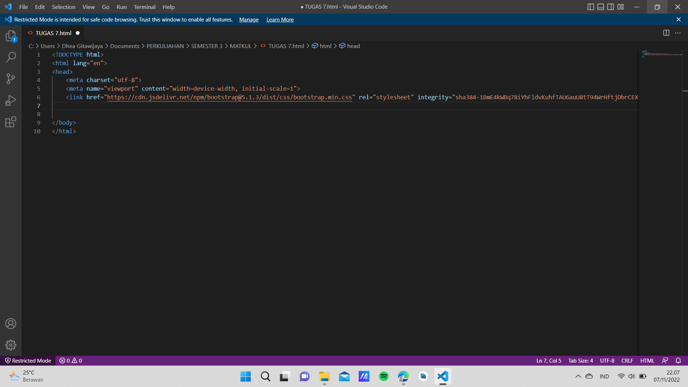

2. Buka web https://getbootstrap.com Disini saya memakai Bootstrap 4. Copy atau download CSS & JS Bootstrap, di dalam penggunaan bootsrap ini kita bisa menggunakan dengan dua cara yaitu dengan offline dan online, jika kita menginginkan secara offline maka kita harus mendownload compiled CSS dan JS atau jika kita menginginkan secara online bisa langsung copy framework pada web bootstrap tersebut. Saya mencoba menggunakan cara online.

3. Beri judul dengan layout sederhana, kemudian lanjut membuat layout menggunakan container seperti berikut.
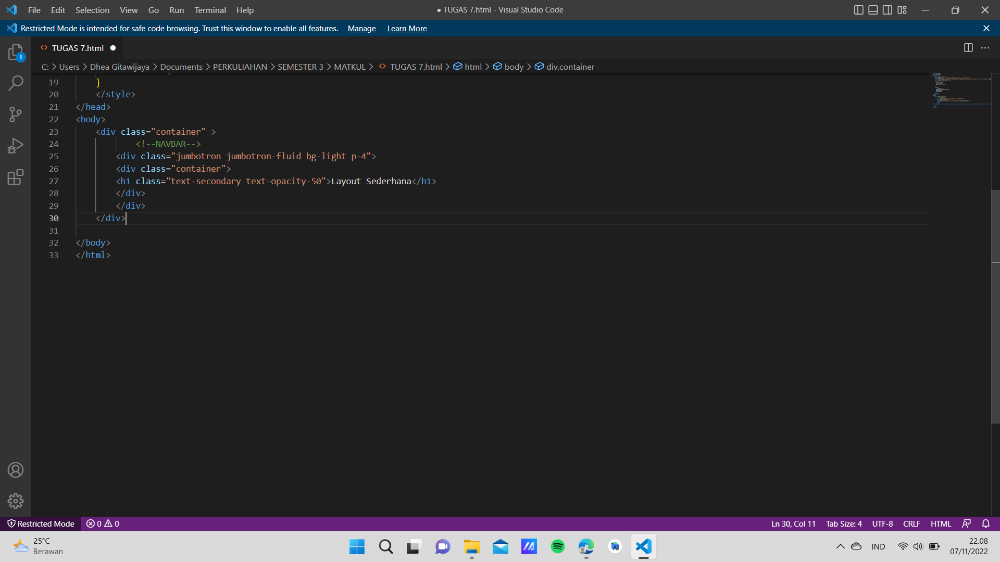

4. Membuat Navbar dengan framework yang ada pada pada bootstrap, Navbar ini berfungsi untuk memberi layanan menuju halaman lain (Navigasi) untuk lebih jelasnya simak pada gambar dibawah ini.
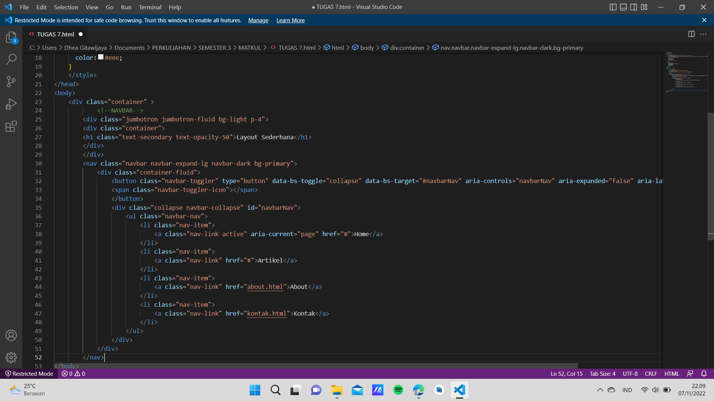

5. Kemudian simpan dan coba lihat hasilnya dengan cara membuka pada web browser.
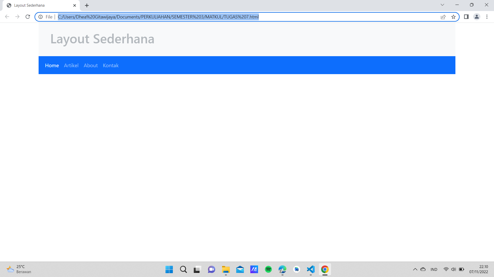

6. Selanjutnya membuat hero panel disini saya menggunakan class jumbroton warna background secondary dan opacity sebesar 25
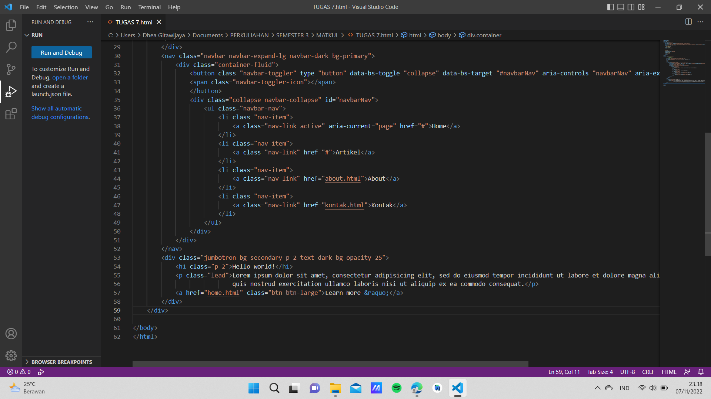

7. kemudian simpan dan muat ulang browser.
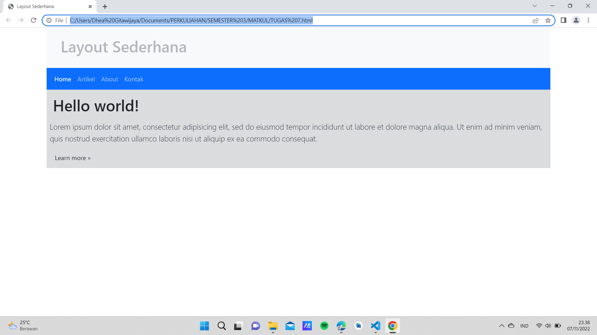

8. Menambah element lain pada content seperti gambar dan lain sebagainya, pada bootstrap kita bisa menggunakan cards, disini saya akan menggunakan col untuk membagi gambar per bagian masing-masing agar hasilnya lebih rapih. Dan membuat gambar menjadi bulat dengan menggunakan class rounded-circle.
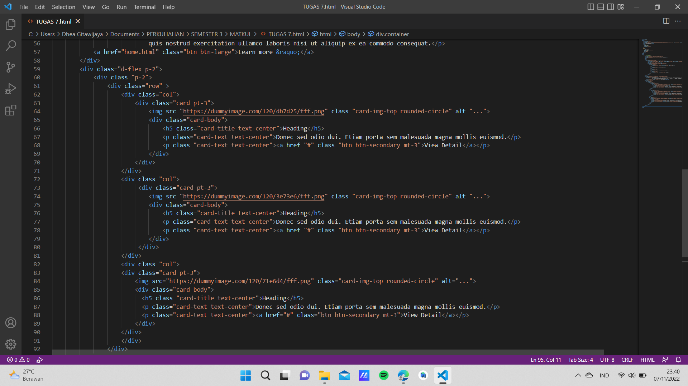

9. Simpan dan coba lihat hasilnya dengan cara membuka pada web browser.

10. Menmbahkan widget link pada sebelah kanan card 1.
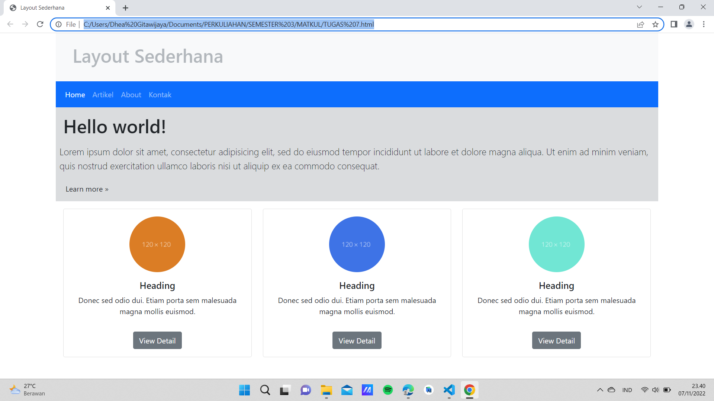

11. Simpan dan coba lihat hasilnya dengan cara membuka pada web browser.
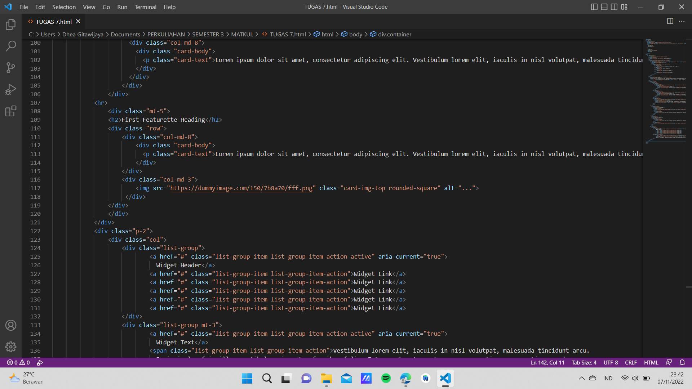

12. Menambah element lain atau card 2 seperti pada gambar dibawah ini.
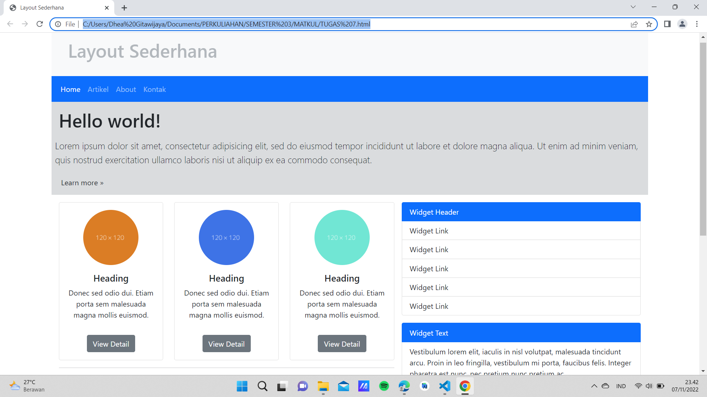

13. Simpan dan coba lihat hasilnya dengan cara membuka pada web browser.
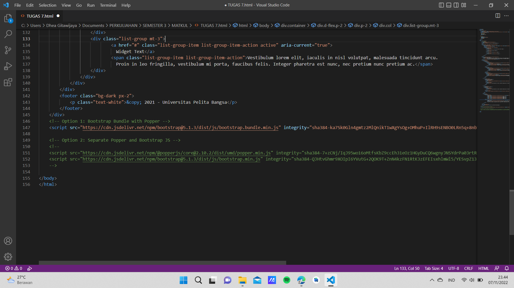

14. Menambaahkn footer.
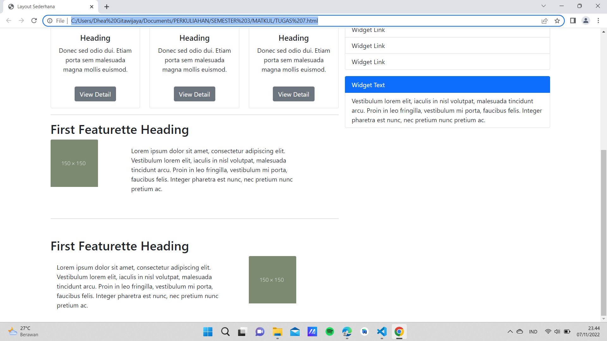

15. Simpan dan coba lihat hasilnya dengan cara membuka pada web browser.
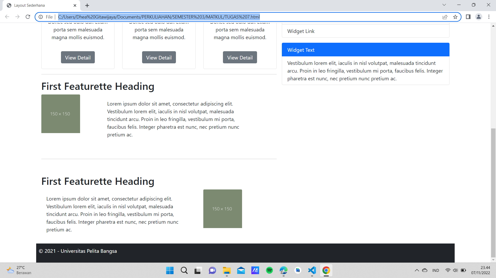

16. Menmbahkan style untuk card dan footer pada head.
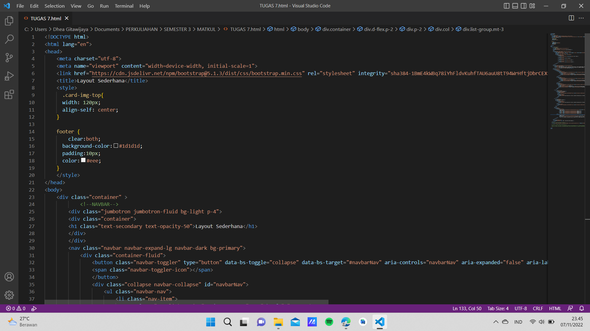

17. Simpan dan coba lihat hasilnya dengan cara membuka pada web browser.

